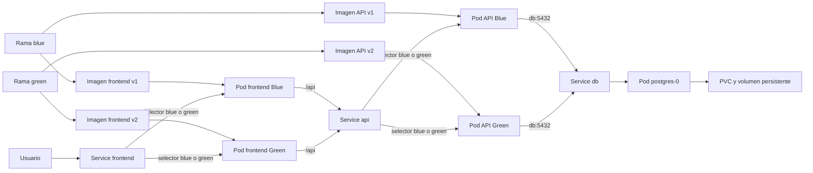

# Arquitectura e infraestructura del proyecto Pet-Core

Este documento explica, en lenguaje sencillo, cómo está organizado el proyecto y cómo se relacionan Docker, Docker Compose, Kubernetes, FastAPI y PostgreSQL.

El objetivo no es explicar cada endpoint, sino entender **cómo se prepara y ejecuta el sistema completo**.

## 1. Idea general

El proyecto tiene tres partes principales:

- **Frontend:** interfaz realizada con React y Vite.
- **API:** backend realizado con Python y FastAPI.
- **Base de datos:** PostgreSQL.

Docker permite empaquetar cada parte con todo lo que necesita para ejecutarse. Docker Compose permite levantar varias partes juntas en una computadora. Kubernetes administra los contenedores como Pods dentro de un clúster.

### Conceptos básicos

| Concepto | Explicación sencilla |
| --- | --- |
| Código fuente | Los archivos escritos por el equipo, por ejemplo los archivos Python de `app/`. |
| Imagen Docker | Una plantilla que contiene el código, Python y las dependencias necesarias. |
| Contenedor | Una instancia en ejecución de una imagen Docker. |
| Pod | La unidad mínima que administra Kubernetes. En este proyecto cada Pod contiene un contenedor principal. |
| Manifiesto | Un archivo YAML que declara cómo queremos que Kubernetes cree un recurso. |
| Service de Kubernetes | Una dirección estable que permite encontrar uno o varios Pods aunque sean reemplazados y cambien de IP. |
| Volumen | Almacenamiento separado del contenedor. Permite conservar datos. |

## 2. Vista general de la estructura

```text
Proyecto_Clínica_Veterinaria/
|
|-- app/                              Código de FastAPI
|   |-- Auth/                         Login, registro y usuario autenticado
|   |-- Middleware/                   Validación de tokens JWT
|   |-- tipos_atencion/               Funcionalidad de tipos de atención
|   |-- config.py                     Lee la configuración del entorno
|   |-- database.py                   Crea la conexión y las sesiones de base de datos
|   `-- main.py                       Punto de entrada de FastAPI
|
|-- db/
|   |-- init/                         SQL ejecutados al crear una base vacía
|   |   |-- 01_schema.sql
|   |   |-- 02_permisos.sql
|   |   |-- 03_excepcion_disponibilidad.sql
|   |   `-- 04_datos_prueba.sql
|   |-- password.txt                  Contraseña local; no se guarda en Git
|   `-- jwt-secret.txt                Clave JWT local; no se guarda en Git
|
|-- frontend/                         Aplicación React y Vite
|   |-- Dockerfile                    Entorno de desarrollo usado por Compose
|   |-- Dockerfile.k8s                Imagen de producción usada por Kubernetes
|   |-- nginx.conf                    Sirve React y reenvía /api hacia FastAPI
|   |-- .dockerignore                 Excluye archivos del contexto del frontend
|   |-- package.json                  Dependencias generales de JavaScript
|   |-- package-lock.json             Versiones exactas de esas dependencias
|   `-- src/                          Código del frontend
|
|-- k8s/                              Manifiestos de Kubernetes
|   |-- namespace.yaml
|   |-- postgres-service.yaml
|   |-- postgres-statefulset.yaml
|   |-- api-blue-deployment.yaml
|   |-- api-green-deployment.yaml
|   |-- api-service.yaml
|   |-- frontend-blue-deployment.yaml
|   |-- frontend-green-deployment.yaml
|   `-- frontend-service.yaml
|
|-- scripts/
|   |-- k8s-up.ps1                    Construye y despliega Blue v1
|   |-- k8s-up-green.ps1              Construye y despliega Green v2
|   |-- k8s-switch-green.ps1          Cambia el tráfico a Green
|   `-- k8s-switch-blue.ps1           Devuelve el tráfico a Blue
|
|-- Dockerfile                        Imagen de la API
|-- compose.yaml                      Entorno local con Docker Compose
|-- pyproject.toml                    Datos y dependencias directas de Python
|-- uv.lock                           Versiones exactas de dependencias de Python
|-- .dockerignore                     Archivos que Docker no recibe al construir
|-- .gitignore                        Archivos que Git no debe guardar
`-- README.md                         Instrucciones para ejecutar el proyecto
```

## 3. Qué hace cada archivo principal

### `Dockerfile`

Construye la imagen Docker de la API. No levanta PostgreSQL ni Kubernetes: solamente define cómo preparar FastAPI.

Su recorrido es el siguiente:

1. `FROM python:3.13-slim` usa una imagen liviana con Python 3.13.
2. `WORKDIR /app` crea o selecciona `/app` como carpeta de trabajo dentro de la imagen.
3. `RUN pip install ... uv` instala `uv` dentro de la imagen.
4. `COPY pyproject.toml uv.lock ./` copia primero la definición de dependencias.
5. `RUN uv sync --locked` instala las versiones exactas registradas en `uv.lock`.
6. `COPY app ./app` copia el código de FastAPI.
7. `EXPOSE 8000` documenta que la aplicación escucha en el puerto 8000. Por sí solo no publica el puerto en Windows.
8. `CMD [...]` define el comando que inicia FastAPI cuando se crea un contenedor desde la imagen.

El resultado es una imagen que puede recibir un nombre como `clinica-veterinaria:v1`. Docker Compose o Kubernetes pueden ejecutar contenedores a partir de ella.

### `.dockerignore`

Cuando se construye una imagen, Docker recibe una carpeta llamada **contexto de construcción**. Este archivo evita enviar elementos que no se necesitan, por ejemplo:

- `.venv`;
- caché de Python;
- `.env`;
- información interna de Git.

Esto reduce el contexto y evita copiar accidentalmente archivos locales dentro de una imagen.

### `pyproject.toml`

Describe el proyecto Python:

- nombre y versión del proyecto;
- versión de Python requerida;
- dependencias directas, como FastAPI, Psycopg, PyJWT y Pydantic Settings.

Es el archivo que se modifica mediante comandos como `uv add nombre-paquete`.

### `uv.lock`

Guarda la resolución completa y las versiones exactas de las dependencias directas y de sus dependencias internas.

Por ejemplo, el equipo declara FastAPI en `pyproject.toml`, pero FastAPI necesita otros paquetes. Es normal que `uv.lock` sea mucho más largo. Su función es que todos instalen el mismo conjunto de versiones.

No se edita manualmente y sí se guarda en Git.

### `.gitignore`

Indica qué archivos locales no deben entrar en los commits. En este proyecto protege especialmente:

- `.venv/`;
- cachés de Python;
- `.env`;
- `db/password.txt`;
- `db/jwt-secret.txt`.

`db/password.txt` y `db/jwt-secret.txt` contienen secretos. Cada integrante debe crear sus propios archivos después de descargar el proyecto.

### `compose.yaml`

Describe el entorno de desarrollo local. Actualmente define tres servicios:

#### Servicio `frontend`

- Construye la imagen usando `frontend/Dockerfile`.
- Publica el puerto `5173` de Vite en el puerto `5173` de Windows.
- Monta `frontend/` dentro del contenedor para mostrar cambios sin reconstruir constantemente la imagen.
- Conserva `node_modules` dentro del entorno del contenedor.

#### Servicio `server`

- Construye la API usando el `Dockerfile` de la raíz.
- Publica el puerto `8000`.
- entrega a `app/config.py` las variables necesarias para encontrar PostgreSQL.
- Le entrega el archivo de contraseña y la clave JWT mediante Secrets.
- Usa `depends_on` con `service_healthy` para esperar a que PostgreSQL acepte conexiones.

La dirección de la base no es `localhost`. Es `db`, porque ese es el nombre del servicio de PostgreSQL dentro de la red de Compose.

#### Servicio `db`

- Usa la imagen oficial `postgres:18`.
- Publica PostgreSQL en `5432:5432` para permitir pruebas desde Windows.
- Lee su contraseña desde `/run/secrets/db-password`.
- Ejecuta los SQL montados en `/docker-entrypoint-initdb.d` cuando encuentra una base vacía.
- Usa `pg_isready` como comprobación de salud.
- Guarda los datos reales en el volumen `postgres_data`.

#### Volumen `postgres_data`

Se encuentra separado del contenedor. Si el contenedor de PostgreSQL se reemplaza, los datos permanecen mientras el volumen no sea eliminado.

Por esa misma razón, los archivos de inicialización SQL no vuelven a ejecutarse cada vez que se reinicia el contenedor.

#### Secrets de Compose

Esta última sección declara de dónde obtiene Docker Compose cada secreto:

- `db-password` se obtiene desde `db/password.txt`.
- `jwt-secret` se obtiene desde `db/jwt-secret.txt`.

En esta sección solamente se define el origen de cada secreto; todavía no se entrega a ningún contenedor.

Después, dentro de cada servicio, la propiedad `secrets` indica cuáles puede utilizar. Docker Compose coloca esos secretos como archivos dentro del contenedor:

- FastAPI recibe `db-password` y `jwt-secret`.
- PostgreSQL recibe solamente `db-password`, porque no necesita la clave JWT.

### `frontend/Dockerfile`

Construye el entorno del frontend:

1. Usa Node 22.
2. Selecciona `/app` como carpeta de trabajo.
3. Copia `package.json` y `package-lock.json`.
4. Ejecuta `npm ci` para instalar versiones exactas.
5. Copia el código restante.
6. Inicia Vite en el puerto 5173.

Este Dockerfile se usa desde Docker Compose para trabajar con el servidor de desarrollo de Vite. Kubernetes utiliza otro Dockerfile preparado para servir la versión ya construida del frontend.

### `frontend/Dockerfile.k8s`

Construye la imagen de producción `clinica-frontend:v1` que utiliza Kubernetes. Está dividido en dos etapas:

1. La etapa `build` usa Node 22, instala las dependencias con `npm ci` y ejecuta `npm run build`.
2. Vite genera en `/app/dist` los archivos HTML, CSS y JavaScript listos para publicar.
3. `ARG` y `ENV` entregan `VITE_API_URL=/api` durante la construcción. Esta dirección queda incorporada en el frontend y no contiene un secreto.
4. La etapa `runner` comienza desde `nginxinc/nginx-unprivileged`, una imagen de Nginx preparada para ejecutarse sin permisos de administrador.
5. Copia `nginx.conf` y solamente el resultado de `/app/dist`; no necesita llevar Node ni el código fuente completo a la imagen final.
6. Nginx escucha en el puerto 8080 y sirve el frontend ya construido.

El resultado de la primera etapa se copia a la segunda mediante `COPY --from=build`. Esto se denomina **construcción multietapa** y permite que la imagen final tenga solamente lo necesario para ejecutar el frontend.

### `frontend/nginx.conf`

Configura cómo Nginx atiende las solicitudes dentro del Pod del frontend:

- sirve los archivos construidos desde `/usr/share/nginx/html`;
- escucha en el puerto 8080, que no requiere permisos de administrador;
- usa `try_files $uri /index.html` para que las rutas manejadas por React vuelvan a `index.html`;
- comprime contenido con gzip y configura caché para los archivos estáticos;
- intercepta las solicitudes que comienzan con `/api/` y las reenvía a `http://api:8000/`.

`api` no es una IP fija: es el nombre del Service de FastAPI dentro del mismo Namespace. Por ejemplo, el navegador solicita `/api/auth/login`, Nginx quita el prefijo `/api` y envía `/auth/login` al Service `api`.

Este proxy permite que el navegador acceda al frontend y a la API desde la misma dirección externa. El nombre interno `api` solamente necesita ser conocido por Nginx dentro de Kubernetes.

### `frontend/.dockerignore`

Define qué elementos de `frontend/` no se envían al construir su imagen:

- `node_modules`, porque las dependencias se reconstruyen con `npm ci`;
- `dist`, porque se vuelve a generar con `npm run build`;
- `.vite/` y archivos de log, porque son temporales;
- archivos `.env`, para no incluir configuración local accidentalmente.

## 4. Carpeta `app`: cómo se organiza FastAPI

Aunque el foco de este documento es la infraestructura, estos archivos explican qué recibe el contenedor de la API.

### `app/main.py`

Es el punto de entrada. Crea la aplicación FastAPI y registra:

- CORS para permitir solicitudes del frontend local;
- el middleware JWT;
- los routers de login, registro, usuario autenticado y tipos de atención;
- la ruta `/`, utilizada actualmente por la comprobación de disponibilidad de Kubernetes.

### `app/config.py`

Lee variables de entorno y archivos de secretos. Con esos valores:

- obtiene servidor, puerto, usuario, contraseña y base de PostgreSQL;
- construye la dirección de conexión;
- lee la clave usada para firmar y validar JWT;
- lee los límites de intentos y tiempo de bloqueo del login.

Este archivo permite usar el mismo código en Compose y Kubernetes. Lo que cambia es quién proporciona la configuración.

### `app/database.py`

Crea el motor de conexión a PostgreSQL y entrega una sesión a los endpoints que la necesiten.

Las funcionalidades actuales usan esa sesión para ejecutar consultas SQL escritas en los repositorios.

### Carpetas de funcionalidades

Las funcionalidades están separadas en carpetas como `Auth/` y `tipos_atencion/`. Dentro de ellas se sigue esta idea:

| Archivo | Responsabilidad |
| --- | --- |
| `controller.py` | Declara la URL y el método HTTP. Recibe la petición y devuelve la respuesta. |
| `dto.py` | Define qué campos entran o salen y valida su formato. |
| `service.py` | Contiene reglas del negocio y decide qué operación realizar. |
| `repository.py` | Ejecuta las consultas SQL contra PostgreSQL. |

El recorrido habitual es:

```text
Petición HTTP
    -> controller
    -> service
    -> repository
    -> database.py
    -> PostgreSQL
```

La respuesta vuelve en el orden contrario.

## 5. Carpeta `db/init`

Los archivos tienen prefijos numéricos para definir su orden de ejecución:

### `01_schema.sql`

Crea la estructura principal de la base: tablas, claves, restricciones e índices.

### `02_permisos.sql`

Crea o actualiza el usuario de aplicación `petcore_app` usando la contraseña del Secret. Después le entrega los permisos que necesita.

FastAPI se conecta como `petcore_app`, no como el superusuario `postgres`. Esto limita lo que puede hacer la aplicación.

También retira permisos de modificación o eliminación sobre registros que deben conservarse, como la auditoría.

### `03_excepcion_disponibilidad.sql`

Agrega la estructura para ausencias puntuales de veterinarios. Se separó del esquema inicial para representar una ampliación posterior de la base.

### `04_datos_prueba.sql`

Carga datos de desarrollo:

- tres usuarios con distintos roles;
- mascotas;
- tipos de atención;
- disponibilidad;
- un turno de ejemplo.

### Regla importante de inicialización

La imagen oficial de PostgreSQL ejecuta los archivos de `/docker-entrypoint-initdb.d` en orden solamente cuando el directorio de datos está vacío.

Reiniciar un Pod o un contenedor no vuelve a cargar estos SQL porque el volumen conserva la base anterior. Para probar una inicialización completamente nueva es necesario eliminar intencionalmente el volumen. Esa operación también elimina todos sus datos.

## 6. Kubernetes: qué crea cada archivo

Kubernetes recibe archivos YAML declarativos. Cada archivo dice **qué estado queremos** y Kubernetes intenta mantenerlo.

### `k8s/namespace.yaml`

Crea el Namespace `clinica-veterinaria`.

El Namespace agrupa y separa los recursos de este proyecto de otros recursos que puedan existir en el mismo Minikube.

Dentro de él se crean la API, PostgreSQL, los Services, los Secrets y el ConfigMap.

### `k8s/postgres-service.yaml`

Crea un Service interno llamado `db`.

Su selector busca Pods con la etiqueta:

```yaml
app: postgres
```

El StatefulSet asigna esa misma etiqueta al Pod de PostgreSQL. De esa forma, el Service sabe a qué Pod dirigir las conexiones.

`clusterIP: None` lo convierte en un **Headless Service**. Kubernetes no le asigna una IP virtual para balanceo, pero crea el DNS interno necesario para encontrar directamente el Pod.

FastAPI utiliza `db:5432`; no necesita conocer la IP cambiante de `postgres-0`.

### `k8s/postgres-statefulset.yaml`

Crea y administra PostgreSQL mediante un StatefulSet.

Un **StatefulSet** es un recurso de Kubernetes utilizado para administrar aplicaciones que necesitan conservar una identidad y datos estables.

En este proyecto se usa para PostgreSQL.

Los Pods pueden eliminarse y volver a crearse. Si PostgreSQL guardara sus datos solamente dentro del Pod, al reemplazarlo podríamos perder información.

El StatefulSet permite relacionar PostgreSQL con almacenamiento persistente.

Se usa un StatefulSet porque PostgreSQL tiene estado: sus datos deben conservarse aunque el Pod se reemplace.

Sus partes principales son:

- `serviceName: db`: lo relaciona con el Headless Service.
- `replicas: 1`: solicita un Pod de PostgreSQL.
- `selector` y `labels`: permiten que el StatefulSet y el Service reconozcan ese Pod.
- `image: postgres:18`: define la imagen del contenedor.
- `env`: configura la base y le indica dónde está el archivo de contraseña.
- `volumeMounts`: coloca los Secrets, SQL y datos en rutas internas del contenedor.
- `readinessProbe`: ejecuta `pg_isready` para saber si PostgreSQL acepta conexiones.
- `volumeClaimTemplates`: solicita 1 GiB de almacenamiento persistente.

Los tres montajes cumplen funciones diferentes:

| Montaje dentro del contenedor | Procedencia | Uso |
| --- | --- | --- |
| `/run/secrets` | Secret `postgres-secret` | Contraseña de PostgreSQL. |
| `/docker-entrypoint-initdb.d` | ConfigMap `postgres-init` | Archivos SQL de inicialización. |
| `/var/lib/postgresql` | PVC `postgres-data-postgres-0` | Datos reales y persistentes de PostgreSQL. |

`ReadWriteOnce` permite que el volumen sea utilizado para lectura y escritura desde un nodo de Kubernetes a la vez. En este proyecto es suficiente porque Minikube tiene un nodo y PostgreSQL utiliza una sola réplica.

### `k8s/api-blue-deployment.yaml`

Crea y administra el Pod de FastAPI de la versión Blue.

Se usa un Deployment porque la API no guarda sus datos dentro del Pod. Si el Pod se reemplaza, otro puede ejecutar la misma imagen y conectarse a PostgreSQL.

Sus partes principales son:

- `replicas: 1`: solicita una instancia de la API.
- `image: clinica-veterinaria:v1`: utiliza la imagen Blue construida con el Dockerfile.
- `imagePullPolicy: Never`: obliga a utilizar la imagen guardada dentro de Minikube en vez de buscarla en un registro externo.
- etiquetas `app: clinica-api` y `version: blue`: identifican la aplicación y su versión.
- variables `POSTGRES_*`: permiten que `app/config.py` construya la conexión a `db:5432`.
- variables `JWT_*` y `LOGIN_*`: configuran autenticación y bloqueo.
- montajes de Secrets: proporcionan la contraseña y la clave JWT como archivos de solo lectura.
- `readinessProbe`: consulta `/` en el puerto 8000.

La comprobación actual de la API demuestra que FastAPI responde por HTTP. No comprueba directamente una consulta a PostgreSQL.

### `k8s/api-green-deployment.yaml`

Crea y administra el Pod de FastAPI de la versión Green. Su estructura es equivalente a la de Blue, pero cambia dos datos que identifican la versión:

- utiliza la imagen `clinica-veterinaria:v2`;
- asigna la etiqueta `version: green`.

Green conserva las mismas variables, Secrets, conexión `db:5432` y `readinessProbe` que Blue. De esta manera ambas versiones pueden ejecutarse al mismo tiempo y utilizar el mismo PostgreSQL, mientras el Service decide cuál recibe las solicitudes.

### `k8s/api-service.yaml`

Crea una dirección estable para acceder a la API.

Es de tipo `NodePort`, por lo que puede exponerse fuera del clúster local. El manifiesto guardado utiliza Blue como selección inicial:

```yaml
app: clinica-api
version: blue
```

Al aplicar ese manifiesto, el Service envía tráfico solamente a Pods Blue que estén preparados. Los scripts de cambio pueden modificar el selector del recurso en ejecución a `version: green` y devolverlo luego a `version: blue`, sin cambiar su nombre ni su puerto.

El Service recibe tráfico en su puerto 8000 y lo dirige al puerto llamado `http` del contenedor de FastAPI, que también corresponde al 8000.

### `k8s/frontend-blue-deployment.yaml`

Crea y administra el Pod de Nginx que sirve la versión Blue del frontend.

Sus partes principales son:

- `replicas: 1`: solicita una instancia del frontend;
- `image: clinica-frontend:v1`: utiliza la imagen construida con `frontend/Dockerfile.k8s`;
- `imagePullPolicy: Never`: utiliza la imagen guardada dentro de Minikube y no intenta descargarla de Docker Hub;
- etiquetas `app: clinica-frontend` y `version: blue`: identifican la aplicación y la versión;
- `containerPort: 8080`: coincide con el puerto donde escucha Nginx;
- `readinessProbe`: consulta `/` para comprobar que Nginx puede entregar el frontend;
- `automountServiceAccountToken: false`: evita entregar al Pod credenciales internas de Kubernetes que no necesita.

El Deployment puede reemplazar el Pod si deja de existir. Como el frontend no guarda datos importantes dentro del Pod, no necesita un StatefulSet ni un volumen persistente.

### `k8s/frontend-green-deployment.yaml`

Crea y administra el Pod de Nginx que sirve la versión Green del frontend. Utiliza:

- la imagen `clinica-frontend:v2`;
- las etiquetas `app: clinica-frontend` y `version: green`;
- el mismo puerto 8080 y la misma comprobación de disponibilidad que Blue.

La imagen `v2` contiene el frontend Green ya construido. Este Deployment puede permanecer activo junto a `frontend-blue` porque tienen nombres y etiquetas de versión diferentes.

### `k8s/frontend-service.yaml`

Crea el punto de entrada estable para el frontend. Es de tipo `NodePort`, por lo que Minikube puede proporcionar una URL accesible desde Windows.

El manifiesto guardado utiliza este selector inicial:

```yaml
app: clinica-frontend
version: blue
```

Al aplicarlo, dirige el tráfico al Pod `frontend-blue` que esté preparado. Recibe tráfico en el puerto 8080 y lo envía al puerto llamado `http` del contenedor.

Este Service funciona como interruptor Blue/Green. `k8s-switch-green.ps1` cambia su selector a `version: green`, mientras que `k8s-switch-blue.ps1` lo devuelve a `version: blue`.

## Recursos de Kubernetes creados automáticamente

Algunos son creados por `scripts/k8s-up.ps1` a partir de archivos locales:

| Recurso | Se crea desde | Para qué sirve |
| --- | --- | --- |
| Secret `postgres-secret` | `db/password.txt` | Entrega la contraseña a PostgreSQL y FastAPI. |
| Secret `jwt-secret` | `db/jwt-secret.txt` | Entrega la clave de firma JWT a FastAPI. |
| ConfigMap `postgres-init` | Archivos de `db/init/` | Coloca los SQL dentro del Pod de PostgreSQL. |

Otros son creados automáticamente por Kubernetes:

- Cada Deployment Blue o Green crea su propio ReplicaSet.
- Los ReplicaSets crean los Pods Blue y Green de FastAPI y del frontend.
- El StatefulSet crea el Pod `postgres-0` y solicita un PVC.
- Minikube proporciona el PersistentVolume solicitado por el PVC.

## 7. Scripts de Kubernetes: flujos automatizados

### `scripts/k8s-up.ps1`: construir Blue

Este script evita que cada integrante tenga que recordar y ejecutar todos los comandos manualmente para crear el ambiente Blue. Debe ejecutarse desde la rama `blue`; la comprobación inicial evita construir por error código Green con la etiqueta `v1`.

Su recorrido completo es:

1. Comprueba que Docker y Minikube estén instalados.
2. Comprueba que existan los manifiestos, SQL y archivos secretos requeridos.
3. Comprueba que la contraseña no esté vacía y que la clave JWT tenga al menos 32 caracteres.
4. Verifica que Docker Desktop esté funcionando.
5. Inicia Minikube usando Docker como driver.
6. Construye `clinica-veterinaria:v1` y `clinica-frontend:v1` dentro de Minikube.
7. Crea el Namespace.
8. Crea o actualiza los Secrets desde los archivos locales.
9. Crea o actualiza el ConfigMap desde `db/init/`.
10. Aplica todos los manifiestos de `k8s/`.
11. Reinicia los Deployments Blue de FastAPI y del frontend para que usen las imágenes recién construidas.
12. Espera a que PostgreSQL, FastAPI y Nginx estén preparados.
13. Muestra el estado final de los recursos.

El script puede ejecutarse con:

```powershell
powershell -NoProfile -ExecutionPolicy Bypass -File .\scripts\k8s-up.ps1
```

El script actualiza los recursos, pero no borra el volumen existente. Por lo tanto, repetirlo no elimina la base ni vuelve a ejecutar automáticamente los SQL de inicialización.

### `scripts/k8s-up-green.ps1`: construir Green

Este script se ejecuta después de que Blue ya quedó desplegado. Su recorrido es:

1. Comprueba que Docker y Minikube estén disponibles.
2. Inicia o reanuda Minikube.
3. Comprueba que PostgreSQL y los Deployments Blue estén preparados.
4. Deja los Services apuntando a Blue mientras prepara la nueva versión.
5. Construye `clinica-veterinaria:v2` y `clinica-frontend:v2` dentro de Minikube.
6. Aplica `api-green-deployment.yaml` y `frontend-green-deployment.yaml`.
7. Reinicia y espera los rollouts Green para asegurar que utilicen las imágenes recién construidas.
8. Muestra Blue y Green funcionando al mismo tiempo.

Se ejecuta desde la rama `green` con:

```powershell
powershell -NoProfile -ExecutionPolicy Bypass -File .\scripts\k8s-up-green.ps1
```

Al finalizar, Green está disponible para ser probado, pero el tráfico principal continúa en Blue hasta ejecutar el script de cambio.

### `scripts/k8s-switch-green.ps1`: enviar el tráfico a Green

Utiliza `kubectl set selector` para cambiar los Services `api` y `frontend` a `version: green`. No reconstruye imágenes, no reinicia PostgreSQL y no elimina Blue. Al final consulta los dos Services para mostrar la versión activa.

```powershell
powershell -NoProfile -ExecutionPolicy Bypass -File .\scripts\k8s-switch-green.ps1
```

### `scripts/k8s-switch-blue.ps1`: rollback a Blue

Realiza la operación contraria: cambia los selectores de los dos Services a `version: blue`. Como los Pods Blue permanecen activos, el rollback es rápido y no necesita reconstruir imágenes.

```powershell
powershell -NoProfile -ExecutionPolicy Bypass -File .\scripts\k8s-switch-blue.ps1
```

## 8. Flujo completo con Docker Compose

El inicio local se realiza con:

```powershell
docker compose up --build
```

El flujo es:

```text
compose.yaml
    |-- construye el frontend con frontend/Dockerfile
    |-- construye FastAPI con Dockerfile
    `-- descarga o reutiliza postgres:18

PostgreSQL inicia
    -> monta postgres_data
    -> si la base está vacía, ejecuta db/init/*.sql
    -> pg_isready lo marca como saludable

FastAPI inicia
    -> lee los Secrets y variables
    -> encuentra PostgreSQL usando db:5432
    -> queda disponible en localhost:8000

Frontend inicia
    -> queda disponible en localhost:5173
    -> llama a la API en localhost:8000
```

Compose crea automáticamente una red para que los servicios se encuentren por nombre.

## 9. Flujo completo con Kubernetes



Explicado paso a paso:

1. Desde la rama `blue`, `k8s-up.ps1` construye las imágenes `v1` y despliega Blue junto con PostgreSQL.
2. Desde la rama `green`, `k8s-up-green.ps1` construye las imágenes `v2` y agrega los Deployments Green sin eliminar Blue.
3. Los cuatro Pods de aplicación pueden quedar ejecutándose al mismo tiempo: API Blue, API Green, frontend Blue y frontend Green.
4. El StatefulSet mantiene un único Pod `postgres-0` y un único volumen persistente compartido por las dos API.
5. El Service `frontend` selecciona la versión del frontend que recibe las solicitudes del usuario.
6. Nginx sirve React y reenvía las solicitudes `/api` al Service interno `api`.
7. El Service `api` selecciona la versión de FastAPI que recibe esas solicitudes.
8. Tanto la API Blue como la Green encuentran PostgreSQL con el nombre estable `db:5432`.
9. `k8s-switch-green.ps1` cambia ambos Services a Green.
10. `k8s-switch-blue.ps1` devuelve ambos Services a Blue si es necesario hacer rollback.

Los Services deben cambiar juntos para que el frontend y la API correspondan a la misma versión. El cambio no copia datos ni reinicia la base: solamente modifica qué etiquetas buscan los Services.

Para obtener la URL:

```powershell
minikube service frontend --namespace=clinica-veterinaria --url
```

En Windows con el driver Docker, la terminal que mantiene ese túnel debe permanecer abierta. La API también puede exponerse directamente con `minikube service api --namespace=clinica-veterinaria --url`, por ejemplo para usar Swagger sin pasar por Nginx.

## 10. Qué le proporciona cada componente al siguiente

| Componente | Consume | Proporciona |
| --- | --- | --- |
| `pyproject.toml` | Decisiones del equipo sobre dependencias | Lista general de paquetes Python. |
| `uv.lock` | `pyproject.toml` y resolución de `uv` | Versiones exactas reproducibles. |
| `Dockerfile` | Código de `app/`, `pyproject.toml` y `uv.lock` | Imagen ejecutable de FastAPI. |
| `frontend/Dockerfile.k8s` | Código del frontend, dependencias y `nginx.conf` | Imagen de producción del frontend. |
| `compose.yaml` | Dockerfiles, imagen de PostgreSQL, Secrets y SQL | Entorno local completo de tres servicios. |
| `namespace.yaml` | Nombre elegido para el proyecto | Espacio separado dentro del clúster. |
| Secrets | Archivos secretos locales | Contraseña y clave JWT montadas en los Pods. |
| ConfigMap | Archivos de `db/init/` | SQL montados dentro del Pod de PostgreSQL. |
| StatefulSet | Imagen PostgreSQL, Secret, ConfigMap y almacenamiento | Pod estable de PostgreSQL. |
| Service `db` | Pods con `app: postgres` | Nombre estable `db:5432`. |
| Deployment `api-blue` | Imagen `clinica-veterinaria:v1`, variables y Secrets | Pod de FastAPI con etiqueta `version: blue`. |
| Deployment `api-green` | Imagen `clinica-veterinaria:v2`, variables y Secrets | Pod de FastAPI con etiqueta `version: green`. |
| Service `api` | Pods preparados con la versión seleccionada | Punto estable hacia la API Blue o Green. |
| Deployment `frontend-blue` | Imagen `clinica-frontend:v1` | Pod de Nginx con etiqueta `version: blue`. |
| Deployment `frontend-green` | Imagen `clinica-frontend:v2` | Pod de Nginx con etiqueta `version: green`. |
| Service `frontend` | Pods preparados con la versión seleccionada | Entrada externa al frontend Blue o Green. |
| `nginx.conf` | Archivos de React y Service interno `api` | Interfaz web y proxy de `/api` hacia FastAPI. |
| `k8s-up.ps1` | Rama Blue y manifiestos base | Construcción y despliegue de Blue `v1`. |
| `k8s-up-green.ps1` | Blue funcionando y rama Green | Construcción y despliegue de Green `v2`. |
| Scripts `k8s-switch-*` | Services y Deployments Blue/Green preparados | Cambio de tráfico y rollback. |

## 11. Estado actual de Blue/Green

Actualmente el despliegue Blue/Green está implementado para FastAPI y el frontend:

| Versión | Imágenes | Deployments | Etiqueta |
| --- | --- | --- | --- |
| Blue | `clinica-veterinaria:v1` y `clinica-frontend:v1` | `api-blue` y `frontend-blue` | `version: blue` |
| Green | `clinica-veterinaria:v2` y `clinica-frontend:v2` | `api-green` y `frontend-green` | `version: green` |

Los manifiestos de los Services conservan Blue como valor inicial. En el clúster, los scripts `k8s-switch-green.ps1` y `k8s-switch-blue.ps1` cambian ese selector sin editar el manifiesto cada vez.

La demostración completa es:

1. Desplegar Blue desde la rama `blue` con `k8s-up.ps1`.
2. Desplegar Green desde la rama `green` con `k8s-up-green.ps1`.
3. Comprobar que ambas versiones están preparadas.
4. Ejecutar `k8s-switch-green.ps1` y probar la versión nueva.
5. Ejecutar `k8s-switch-blue.ps1` para demostrar el rollback.

No es necesario duplicar el código en dos carpetas. Las dos versiones quedan representadas por imágenes Docker distintas.

Para demostrarlo al docente se podrán mostrar:

```powershell
minikube kubectl -- get pods -L version --namespace=clinica-veterinaria
minikube kubectl -- get service api --namespace=clinica-veterinaria -o jsonpath="{.spec.selector.version}"
minikube kubectl -- get service frontend --namespace=clinica-veterinaria -o jsonpath="{.spec.selector.version}"
```

El primer comando muestra los Pods y sus versiones. Los otros dos muestran de forma directa qué versión seleccionan los Services de la API y del frontend.

## 12. Diferencia entre Compose y Kubernetes en este proyecto

| Docker Compose | Kubernetes con Minikube |
| --- | --- |
| Pensado para desarrollo local sencillo. | Pensado para practicar orquestación y despliegues. |
| Levanta una versión del frontend, la API y PostgreSQL. | Mantiene frontend y API Blue/Green junto a PostgreSQL. |
| `compose.yaml` concentra toda la definición. | La configuración se divide en varios manifiestos. |
| Usa contenedores directamente. | Administra los contenedores dentro de Pods. |
| Usa `postgres_data` como volumen nombrado. | Usa PVC y PV para PostgreSQL. |
| Los nombres de servicios permiten la comunicación interna. | Los Services y el DNS interno permiten la comunicación. |
| Usa Secrets definidos en Compose. | Usa objetos Secret del Namespace. |
| No realiza un cambio Blue/Green. | Cambia el tráfico mediante los selectores de los Services. |

## 13. Aclaraciones importantes

- Un Dockerfile **construye una imagen**; no crea por sí solo todo el sistema.
- Compose y Kubernetes consumen imágenes, pero organizan su ejecución de forma diferente.
- Un Pod puede ser reemplazado y cambiar de IP; un Service proporciona una dirección estable.
- La API es administrada por un Deployment porque no guarda datos locales importantes.
- PostgreSQL es administrado por un StatefulSet porque necesita identidad y almacenamiento estable.
- Los Secrets no deben quedar escritos en el código ni subirse a Git.
- Un ConfigMap se utiliza para datos no confidenciales, como los SQL de inicialización.
- El PVC permite que los datos sobrevivan al reemplazo del Pod.
- Una readiness probe decide si un Pod está preparado para recibir tráfico; no es lo mismo que una liveness probe.
- Los SQL de inicialización solamente se ejecutan sobre una base vacía.
- `minikube stop` detiene el clúster, pero no está pensado para borrar los datos persistentes.
- Blue y Green comparten PostgreSQL y el mismo PVC; no existe un volumen separado por versión.
- Para conservar la posibilidad de rollback, los cambios de esquema de Green deben ser compatibles con Blue.
- Los Services guardados en YAML comienzan apuntando a Blue; los scripts de cambio modifican los selectores del clúster en ejecución.

## 14. Documentación oficial utilizada

Las fuentes se agrupan según la parte del proyecto para la que fueron utilizadas.

### 14.1. FastAPI y administración del proyecto Python

- [Primeros pasos de FastAPI](https://fastapi.tiangolo.com/tutorial/first-steps/): se utilizó para crear la aplicación, levantar el servidor de desarrollo y acceder a la documentación automática en `/docs`.
- [FastAPI dentro de un contenedor Docker](https://fastapi.tiangolo.com/deployment/docker/): se utilizó para definir cómo iniciar FastAPI desde el Dockerfile.
- [Caché durante la construcción de FastAPI](https://fastapi.tiangolo.com/deployment/docker/#docker-cache): se utilizó como referencia para copiar primero los archivos de dependencias y aprovechar la caché de Docker.
- [Iniciar el contenedor de FastAPI](https://fastapi.tiangolo.com/deployment/docker/#start-the-docker-container): se utilizó como referencia para `docker run`, el nombre del contenedor y la publicación del puerto 8000.
- [Proyectos administrados con uv](https://docs.astral.sh/uv/guides/projects/): se utilizó para crear el proyecto y agregar dependencias con `uv add`.
- [Estructura de proyectos y `uv.lock`](https://docs.astral.sh/uv/concepts/projects/layout/): se utilizó para explicar la función de `pyproject.toml`, `.venv` y `uv.lock`.
- [Integración de uv con Docker](https://docs.astral.sh/uv/guides/integration/docker/#installing-uv): se utilizó para instalar y ejecutar uv dentro de la imagen de la API.

### 14.2. Dockerfile, archivos ignorados y Docker Compose

- [Guía oficial de Docker para Python](https://docs.docker.com/guides/python/): se utilizó como referencia para `.gitignore`, `.dockerignore`, la estructura inicial del Dockerfile, el servicio de FastAPI y la conexión con PostgreSQL.
- [Referencia oficial de Dockerfile](https://docs.docker.com/reference/dockerfile/): se utilizó para explicar `FROM`, `WORKDIR`, `RUN`, `COPY`, `EXPOSE` y `CMD`.
- [Modelo de aplicación de Docker Compose](https://docs.docker.com/compose/intro/compose-application-model/): se utilizó para explicar servicios, redes, volúmenes y el funcionamiento general de `compose.yaml`.
- [Servicios de Docker Compose](https://docs.docker.com/reference/compose-file/services/): se utilizó para `build`, `ports`, `volumes`, `environment`, `depends_on` y `healthcheck`.
- [Secrets en Docker Compose](https://docs.docker.com/compose/how-tos/use-secrets/): se utilizó para declarar `db-password` y `jwt-secret`, entregarlos solamente a los servicios que los necesitan y montarlos como archivos.
- [Guía oficial de PostgreSQL con Docker Compose](https://docs.docker.com/guides/postgresql/#docker-compose-configuration): se utilizó para definir el servicio `db`, su imagen, puerto, nombre y volumen.

### 14.3. Imagen oficial de PostgreSQL e inicialización de la base

- [Imagen oficial de PostgreSQL](https://hub.docker.com/_/postgres): se utilizó para las variables `POSTGRES_DB`, `POSTGRES_USER` y `POSTGRES_PASSWORD_FILE` y para montar los SQL en `/docker-entrypoint-initdb.d`.
- [Variables de entorno de la imagen PostgreSQL](https://github.com/docker-library/docs/blob/master/postgres/README.md#environment-variables): se utilizó para configurar el contenedor de PostgreSQL.
- [Docker Secrets en la imagen PostgreSQL](https://github.com/docker-library/docs/blob/master/postgres/README.md#docker-secrets): se utilizó para leer la contraseña desde un archivo mediante `POSTGRES_PASSWORD_FILE`.

La documentación de la imagen oficial también establece que los archivos de `/docker-entrypoint-initdb.d` se ejecutan en orden solamente cuando el directorio de datos está vacío. Esta regla explica por qué no se vuelven a ejecutar los SQL al reiniciar un contenedor o Pod que conserva su volumen.

### 14.4. Instalación y preparación de Kubernetes con Minikube

- [Instalar kubectl en Windows](https://kubernetes.io/es/docs/tasks/tools/install-kubectl-windows/#install-on-windows-using-chocolatey-o-scoop): se utilizó para instalar kubectl y comprobar su versión.
- [Comando `minikube version`](https://minikube.sigs.k8s.io/docs/commands/version/): se utilizó para comprobar la instalación de Minikube.
- [Driver Docker de Minikube](https://minikube.sigs.k8s.io/docs/drivers/docker/#verify-docker-container-type-is-linux): se utilizó para comprobar que Docker ejecuta contenedores Linux y para iniciar el clúster con `minikube start --driver=docker`.
- [Comando `minikube status`](https://minikube.sigs.k8s.io/docs/commands/status/): se utilizó para comprobar el estado del clúster.
- [Usar kubectl incluido en Minikube](https://minikube.sigs.k8s.io/docs/handbook/kubectl/): se utilizó para ejecutar comandos mediante `minikube kubectl --` y evitar problemas de diferencia de versiones.
- [Interactuar con el clúster de Minikube](https://minikube.sigs.k8s.io/docs/start/): se utilizó como referencia para consultar nodos y Pods.
- [Construir imágenes dentro de Minikube](https://minikube.sigs.k8s.io/docs/handbook/pushing/#8-building-images-to-in-cluster-container-runtime): se utilizó para construir `clinica-veterinaria:v1` y `clinica-frontend:v1` dentro del runtime del clúster.
- [Comandos de imágenes de Minikube](https://minikube.sigs.k8s.io/docs/commands/image/): se utilizó para `minikube image build` y `minikube image ls`.
- [Comando `minikube service`](https://minikube.sigs.k8s.io/docs/commands/service/): se utilizó para obtener URLs locales de los Services `api` y `frontend`.

### 14.5. Namespace, aplicación de manifiestos y recursos de configuración

- [Crear y consultar Namespaces](https://kubernetes.io/docs/tasks/administer-cluster/namespaces/): se utilizó para crear `namespace.yaml` y comprobar el Namespace `clinica-veterinaria`.
- [`kubectl apply`](https://kubernetes.io/docs/reference/kubectl/generated/kubectl_apply/): se utilizó para validar, crear y actualizar los recursos declarados en los manifiestos YAML.
- [`kubectl get`](https://kubernetes.io/docs/reference/kubectl/generated/kubectl_get/): se utilizó para consultar Pods, Services, StatefulSets, Deployments, PVC, ConfigMaps y Secrets.
- [`kubectl create secret generic`](https://kubernetes.io/docs/reference/kubectl/generated/kubectl_create/kubectl_create_secret_generic/): se utilizó para generar `postgres-secret` y `jwt-secret` desde los archivos locales.
- [Administrar Secrets con kubectl](https://kubernetes.io/docs/tasks/configmap-secret/managing-secret-using-kubectl/): se utilizó para crear y comprobar los Secrets del Namespace.
- [`kubectl create configmap`](https://kubernetes.io/docs/reference/kubectl/generated/kubectl_create/kubectl_create_configmap/): se utilizó para generar `postgres-init` desde la carpeta `db/init`.
- [Concepto de ConfigMap](https://kubernetes.io/docs/concepts/configuration/configmap/): se utilizó para explicar por qué los SQL no confidenciales se almacenan separados de la imagen.
- [Concepto de Secret](https://kubernetes.io/docs/concepts/configuration/secret/): se utilizó para explicar el almacenamiento de contraseñas y claves sensibles fuera de los manifiestos y de la imagen.

### 14.6. Service y StatefulSet de PostgreSQL

- [Services de Kubernetes](https://kubernetes.io/docs/concepts/services-networking/service/): se utilizó para crear el Service `db`, relacionarlo con el Pod mediante etiquetas y explicar el DNS interno `db:5432`.
- [Headless Services](https://kubernetes.io/docs/concepts/services-networking/service/#headless-services): se utilizó específicamente para `clusterIP: None` en `postgres-service.yaml`.
- [Componentes de un StatefulSet](https://kubernetes.io/docs/concepts/workloads/controllers/statefulset/#components): se utilizó para crear `postgres-statefulset.yaml`, su selector, plantilla y relación con el Service.
- [Plantillas de volúmenes de StatefulSet](https://kubernetes.io/docs/concepts/workloads/controllers/statefulset/#volume-claim-templates): se utilizó para `volumeClaimTemplates` y la creación del PVC de PostgreSQL.
- [Volúmenes de Kubernetes](https://kubernetes.io/docs/concepts/storage/volumes/): se utilizó para explicar `volumes`, `volumeMounts` y `mountPath`.
- [Volúmenes de tipo Secret](https://kubernetes.io/docs/concepts/storage/volumes/#secret): se utilizó para montar `postgres-secret` como archivo dentro del Pod.
- [Volúmenes de tipo ConfigMap](https://kubernetes.io/docs/concepts/storage/volumes/#configmap): se utilizó para montar `postgres-init` en `/docker-entrypoint-initdb.d`.
- [Volúmenes persistentes](https://kubernetes.io/docs/concepts/storage/persistent-volumes/): se utilizó para explicar PV, PVC, capacidad, persistencia y `ReadWriteOnce`.
- [Probes de Kubernetes](https://kubernetes.io/docs/concepts/workloads/pods/probes/): se utilizó para configurar y explicar la `readinessProbe` de PostgreSQL.
- [`pg_isready` de PostgreSQL](https://www.postgresql.org/docs/18/app-pg-isready.html): se utilizó como comando para comprobar si PostgreSQL acepta conexiones.

### 14.7. Pruebas, inicialización limpia y acceso a PostgreSQL

- [`psql` de PostgreSQL](https://www.postgresql.org/docs/18/app-psql.html): se utilizó para ejecutar manualmente SQL, comprobar tablas, verificar el rol `petcore_app` y probar la conexión a la base.
- [Escalar un StatefulSet](https://kubernetes.io/docs/tasks/run-application/scale-stateful-set/): se utilizó para reducir PostgreSQL a cero Pods antes de eliminar de forma controlada su almacenamiento de prueba.
- [`kubectl delete`](https://kubernetes.io/docs/reference/kubectl/generated/kubectl_delete/): se utilizó para eliminar el PVC durante la prueba de inicialización limpia. Eliminar el PVC también elimina los datos asociados cuando la política del volumen es `Delete`.
- [`kubectl exec`](https://kubernetes.io/docs/reference/kubectl/generated/kubectl_exec/): se utilizó para ejecutar `psql`, `pg_isready` y otros comandos dentro del Pod de PostgreSQL.
- [`kubectl rollout status`](https://kubernetes.io/docs/reference/kubectl/generated/kubectl_rollout/kubectl_rollout_status/): se utilizó para esperar y comprobar que PostgreSQL y FastAPI quedaran disponibles.

### 14.8. Deployments Blue/Green y Service de la API

- [Deployments de Kubernetes](https://kubernetes.io/docs/concepts/workloads/controllers/deployment/): se utilizó para crear `api-blue` y `api-green`, administrar los Pods de FastAPI y mantener la cantidad de réplicas solicitada.
- [Política de descarga de imágenes](https://kubernetes.io/docs/concepts/containers/images/#image-pull-policy): se utilizó para `imagePullPolicy: Never`, ya que la imagen se construye dentro de Minikube y no se descarga desde un registro.
- [Variables de entorno en contenedores](https://kubernetes.io/docs/tasks/inject-data-application/define-environment-variable-container/): se utilizó para entregar la configuración `POSTGRES_*`, `JWT_*` y `LOGIN_*` a FastAPI.
- [Entregar credenciales de forma segura](https://kubernetes.io/docs/tasks/inject-data-application/distribute-credentials-secure/): se utilizó para montar `postgres-secret` y `jwt-secret` dentro del Pod de la API.
- [Readiness, liveness y startup probes](https://kubernetes.io/docs/tasks/configure-pod-container/configure-liveness-readiness-probes/): se utilizó para configurar la comprobación HTTP de disponibilidad de FastAPI.
- [Services de Kubernetes](https://kubernetes.io/docs/concepts/services-networking/service/): se utilizó para crear `api-service.yaml`, exponer la API mediante `NodePort` y dirigir el tráfico utilizando las etiquetas `app` y `version`.

### 14.9. Frontend de producción en Kubernetes

- [Guía oficial de Docker para React](https://docs.docker.com/guides/reactjs/): se utilizó como base para la construcción multietapa, `npm ci`, la generación de `dist`, la imagen de Nginx y el `.dockerignore` del frontend.
- [Variables de construcción de Docker](https://docs.docker.com/build/building/variables/#env-usage-example): se utilizó para entregar `VITE_API_URL` mediante `ARG` y `ENV` durante la construcción de la imagen.
- [Variables de entorno y modos de Vite](https://vite.dev/guide/env-and-mode.html): se utilizó para explicar por qué las variables con prefijo `VITE_` quedan incorporadas en el frontend durante `npm run build` y no deben contener secretos.
- [Reverse proxy de Nginx](https://docs.nginx.com/nginx/admin-guide/web-server/reverse-proxy/): se utilizó para configurar `location /api/`, `proxy_pass` y los encabezados que Nginx entrega a FastAPI.
- [Deployments de Kubernetes](https://kubernetes.io/docs/concepts/workloads/controllers/deployment/): se utilizó para crear `frontend-blue` y `frontend-green` y mantener sus Pods.
- [Política de descarga de imágenes](https://kubernetes.io/docs/concepts/containers/images/#image-pull-policy): se utilizó para hacer que los Deployments consuman `clinica-frontend:v1` y `clinica-frontend:v2` desde Minikube.
- [Readiness, liveness y startup probes](https://kubernetes.io/docs/tasks/configure-pod-container/configure-liveness-readiness-probes/): se utilizó para comprobar que Nginx puede servir `/` antes de enviarle tráfico.
- [Service de tipo NodePort](https://kubernetes.io/docs/concepts/services-networking/service/#type-nodeport): se utilizó para crear el punto de entrada externo `frontend`.

### 14.10. Automatización y cambio Blue/Green

Los scripts no fueron copiados de una sola página. Reúnen en orden los comandos oficiales ya mencionados para construir imágenes, crear recursos, aplicar manifiestos, esperar rollouts y cambiar selectores.

La preparación de Blue/Green combina dos mecanismos documentados por Kubernetes:

- [Deployments](https://kubernetes.io/docs/concepts/workloads/controllers/deployment/): permiten mantener Pods Blue y Green como cargas separadas.
- [Selectores de Services](https://kubernetes.io/docs/concepts/services-networking/service/): permiten decidir si el tráfico se dirige a Pods con `version: blue` o `version: green`.
- [`kubectl set selector`](https://kubernetes.io/docs/reference/kubectl/generated/kubectl_set/kubectl_set_selector/): se utiliza en los scripts de cambio para actualizar el selector de los Services sin recrearlos.

El diseño Blue/Green de este proyecto es la aplicación conjunta de esos mecanismos: los Deployments mantienen ambas versiones disponibles y los Services actúan como punto de cambio de tráfico y rollback.
